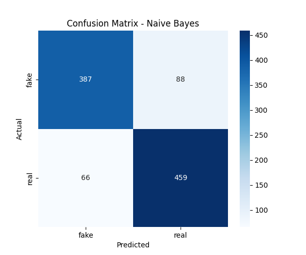
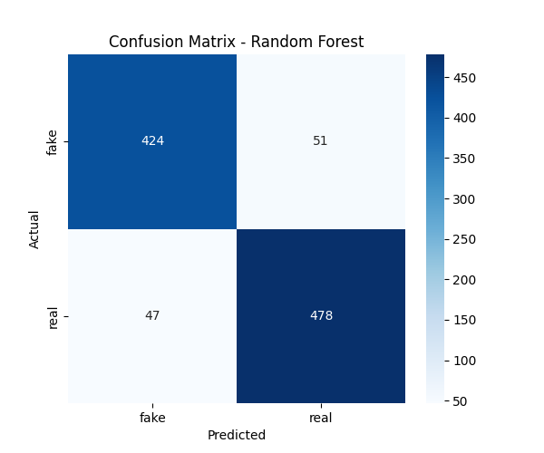

# Fake News Detection using Machine Learning

This project is an end-to-end Natural Language Processing (NLP) application that classifies news articles as "Real" or "Fake."

It uses a `TfidfVectorizer` to process the text data and compares several machine learning models to find the best classifier. The best-performing model (Random Forest) is then saved and served via a simple Flask web application (`app.py`).

## Project Pipeline

1.  **Data Preprocessing (`Fake_news_detection.py`):**
    * Loads the news dataset (e.g., `news.csv`).
    * Cleans the text data using regex to remove non-alphabetic characters.
    * Converts all text to lowercase.
    * Tokenizes the text and applies **Stemming** (using `PorterStemmer`) to reduce words to their root form.
    * Removes all English **stopwords** (e.g., "a", "the", "is") to focus on meaningful words.

2.  **Feature Engineering (`Fake_news_detection.py`):**
    * The cleaned text data is converted into a numerical format using **TF-IDF (Term Frequency-Inverse Document Frequency)**. This creates a matrix of feature vectors based on word importance.

3.  **Model Training & Comparison (`Fake_news_detection.py`):**
    * The data is split into training and testing sets.
    * Three different models are trained and evaluated to find the best performer for this task:
        1.  **Logistic Regression**
        2.  **Random Forest Classifier**
        3.  **Multinomial Naive Bayes**
    * Based on performance (see confusion matrices below), the **Random Forest** model was selected as the best model.

4.  **Model Serialization (`Train and Save Model.py`):**
    * The best model (Random Forest) and the `TfidfVectorizer` are trained on the full dataset and saved as `.joblib` files (`fake_news_model.joblib` and `fake_news_vectorizer.joblib`).

5.  **Deployment (`app.py`):**
    * A simple Flask web application is built to load the saved `.joblib` files.
    * The app provides a web interface where a user can paste a news article, and the app will return a prediction: "Fake News" or "True News."

## Model Performance

The following confusion matrices show the performance of the three benchmarked models on the test set. The Random Forest model provided a strong balance of correctly identifying both True and Fake news.

| Logistic Regression | Naive Bayes | Random Forest (Selected Model) |
| :---: | :---: | :---: |
|  |  |  |

## Technologies Used

* **Python**
* **Flask:** For the web app deployment.
* **Scikit-learn:** For machine learning (TfidfVectorizer, LogisticRegression, RandomForestClassifier, MultinomialNB, train_test_split).
* **NLTK (Natural Language Toolkit):** For text preprocessing (stopwords, PorterStemmer).
* **Pandas:** For data loading and manipulation.
* **Numpy**
* **Joblib:** For saving and loading the trained model.

## How to Run

**1. Clone the repository:**
```bash
git clone [https://github.com/your-username/fake-news-detector-ml.git](https://github.com/your-username/fake-news-detector-ml.git)
cd fake-news-detector-ml
or
once you download the code and install the requirements run this in the project folder terminal after runinng the 'train and save' code once:python3 -m streamlit run app.py
